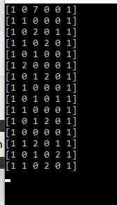
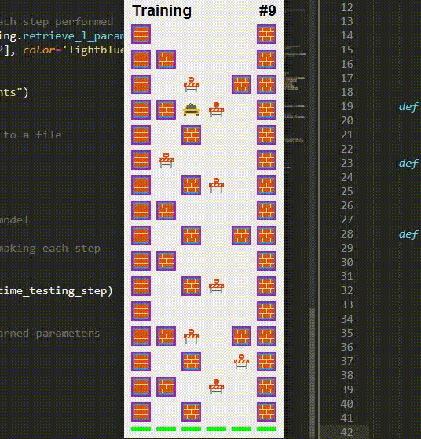

# Simple Q-Learning based approach to self-navigating agents

## About

This simple approach to Q-Learning is helping an agent navigating its way on a pre-defined track to achieve the goal of finding the most successful path (avoid crashing into any obstacles).
During the training process, the agent is punished for hardcore collisions with walls (marked as "1"s on the track). The Q-matrix elements for those actions will obtain negative values to prevent the agent of performing the same mistake again.
Other than that, the training urges the agent to take random Monte-Carlo-simulated actions to achieve a good understanding of the board elements. Other minor obstacles (marked with "2"s on the board) will damage the agent and reduce his life.

After the training is complete, the agent is navigating only using the best actions (as mostly reinforced) by looking up the values in the Q-matrix. Logs are produced for the user to follow the training/testing session. A matplotlib graph is generated to track the convergence of the algorithm.

The training and testing process are executed in headless mode. Logs of the training/testing are saved as numpy/pickle objects. After the training/testing is done, the written logs can be used to display the session again in GUI build with PyQt5.

## Getting Started
To modify the track:

* Open 	`model_objects.py`. Modify the np.array `self.initial_way` to change the track topology. 0 is an open space, 1 is a wall element that causes a major crash. 2 is causing a minor crash, the vehicle can take 3 minor crashes.

To run a training/testing session
* Open `main.py`. Redefine the number of episodes `episodes_nr` to be trained. Increase the variables `time_training_step` and `time_testing_step` if you would like to follow the training/testing in the console. To run the training/testing, run  `python main.py`

Follow the agent navigating its path along the track from top to bottom:

To display the training/testing in a graphical interface
* To display the training/testing performed in a graphical interface, run `python view.py`. Modify the variable `TIME_BETWEEN_STEPS` to change the time between every step update. The view will use the pickle object containing the performed steps and the numpy array saved containing the topology saved during the headless training/testing session.

## Environment
- Python 3.7.2
- PyQt 5.14.2
- numpy1.16.1
- matplotlib 3.0.2

## References
Q-Learning implementation adapted from: 
* http://firsttimeprogrammer.blogspot.com/2016/09/getting-ai-smarter-with-q-learning.html
* http://mnemstudio.org/path-finding-q-learning-tutorial.htm

Adapted the PyQt5 code from: 
* https://www.learnpyqt.com/examples/moonsweeper/

Icons for the GUI:
* https://icons8.com/
